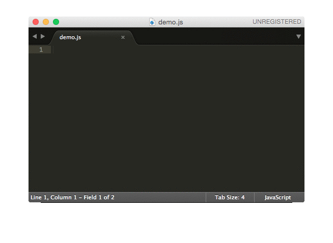

# QuickRequire

Sublime Text 2 and 3 plugin for generating node-style require() calls.

## Example



## Usage

### 1. Type a variable name

```js
var foo
```

### 2. Type the keyboard shortcut

* OS X: <kbd>Cmd</kbd>+<kbd>Shift</kbd>+<kbd>o</kbd>
* Windows: <kbd>Ctrl</kbd>+<kbd>Shift</kbd>+<kbd>o</kbd>
* Linux: <kbd>Ctrl</kbd>+<kbd>Shift</kbd>+<kbd>o</kbd>

### 3. QuickRequire inserts the require() call

```js
var foo = require("foo")
```

Note: an equals sign is also added in front of require()

## Supported variable names

QuickRequire looks at the text on the left of the cursor to generate the module name.

```
foo    -> = require("foo")
Foo    -> = require("foo")
fooBar -> = require("foo-bar")
```

If a variable name isn't found, it generates `require("")`

## Requiring internal modules

QuickRequire doesn't have support for requiring a file relative to the current file. Pairing QuickRequire with [AutoFileName](https://packagecontrol.io/packages/AutoFileName) will get you something decent.

## Settings

Go to `Preferences | Package Settings | QuickRequire` to modify these.

### quote_style

What kind of quotes to use in generated require() call. Defaults to `"double"`.

Expected values: `"double"` or `"single"`

### knownModulesByVariableName

Object that maps variable names to module names. Useful for when names won't match using the naming conventions.

Example:

```json
{
  "knownModulesByVariableName": {
    "_": "lodash"
  }
}
```

## Installation

### Manually

1. `cd` into the [Packages directory](http://docs.sublimetext.info/en/latest/basic_concepts.html#the-packages-directory) of your Sublime Text
2. `git clone https://github.com/psalaets/QuickRequire.git`

### Using Package Control

This plugin wasn't accepted into the Package Control registry so manual install is the only option.
